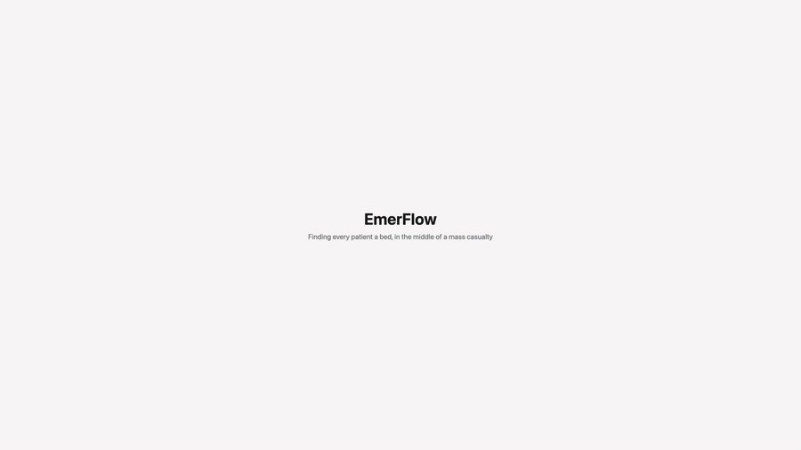

# EmerFlow

**HopHacks 2026 — AI agents that help hospitals move patients during a mass-casualty surge.**

When a bus crash sends 120 people to emergency rooms at once, the hard question isn't medical, it's
logistics: *where does everyone go?* EmerFlow answers it twice over — a public map so crews and civilians
can see which hospitals are actually taking patients, and a command board where eleven AI agents negotiate
placement while code enforces every hard rule and a human approves the big moves.

> **AI talks, code counts, a human approves big moves.**

## Project Demo



*The whole product end to end, sped up: the live EMS map → a crash placed on the map, 120 people hurt → the
command board filling up → the eleven agents negotiating a round on the AI workflow stage → a records
conflict in DeepChart → back to the board.*

## Run it locally

No cloud account and no API key needed — stub mode runs the whole thing offline.

**1. Backend** (FastAPI + the simulated hospital):

```bash
python3 -m venv .venv && .venv/bin/pip install -r requirements.txt
EMERFLOW_STUB=1 .venv/bin/uvicorn backend.main:app --port 8000 --timeout-graceful-shutdown 5
```

**2. Site** (Next.js), in a second terminal:

```bash
cd web && npm install && npm run dev
```

Open **http://localhost:3100**. The dev server proxies `/api` to the backend on `:8000`.

**3. Try it.** Log in at `/login` with PIN `demo`, pick a hospital and a role, then open the board and press
**Bus crash**. Useful entry points:

| URL | What you get |
| --- | --- |
| `/ems` | The public capacity map: who's taking patients, open beds, fastest care by drive time + wait |
| `/board` | The command board — the surge, the agents' plan, and the decisions waiting on you |
| `/board?mock=1` | The board on a fake event stream, no backend and no login (good for a quick look) |
| `/doctor` | DeepChart: the cross-hospital records portal |
| `/workflow`, `/overview` | The agent swarm deciding, live |

**Optional flags**

- `EMERFLOW_RECORDS_CHECK=1` on the backend makes DeepChart hold any move whose records disagree.
- Single-server mode: `cd web && npm run build`, then open http://localhost:8000 — FastAPI serves `web/out`.
  Rebuild after every change under `web/`.

**Tests** — 93 of them, all offline:

```bash
EMERFLOW_STUB=1 .venv/bin/pytest
```

### Running against live Gemini (optional)

```bash
gcloud auth application-default login
export GOOGLE_CLOUD_PROJECT=<your-project> GOOGLE_CLOUD_LOCATION=global
export GEMINI_PRO_MODEL=<coordinator model> GEMINI_LITE_MODEL=<department model>
.venv/bin/uvicorn backend.main:app --port 8000 --timeout-graceful-shutdown 5
```

Copy [`.env.example`](.env.example) to `.env` for the same settings. Every call has a timeout, and after
three failures a circuit breaker falls back to the rule-based answers, so the board never stalls. Live
answers are recorded to `backend/agents/replays/live.jsonl`.

## Repo structure

| Path | What it is |
| --- | --- |
| [`backend/sim/`](backend/sim/) | The simulated hospital: state, rules, the single move pipeline, escalation ladder, scenarios |
| [`backend/agents/`](backend/agents/) | The eight department agents, the coordinator, EMS dispatch, the Gemini client, recorded replays |
| [`backend/deepchart/`](backend/deepchart/) | DeepChart: per-hospital records, identity matching, the merged chart, access logging |
| [`backend/`](backend/) | `gate.py` (records check), `engine.py` (the running loop), `main.py` (the FastAPI app) |
| [`web/`](web/) | The Next.js site: EMS map, command board, workflow view, DeepChart portal, patient links |
| [`frontend/`](frontend/) | The older Vite app (still builds; DeepChart screens and the vendored `agent-workflow` UI package) |
| [`tests/`](tests/) | The pytest suite |
| [`tools/`](tools/) | One-off scripts: record a 20-patient run, record the DeepChart demo, generate faces |
| [`docs/`](docs/) | Pitch, DeepChart spec and legal research, demos, screenshots, archived planning docs — index in [`docs/README.md`](docs/README.md) |
| [`CONTRACT.md`](CONTRACT.md) | The backend ↔ frontend API and event shapes |

## How it works

| Kind | Who | Job |
| --- | --- | --- |
| Department agents (8) | ER, ICU, STEPDOWN, OR, STAFFING, IMAGING, BLOODBANK, EMS | Each sees only its own unit and reports what it can free and what it needs |
| Coordinator (1) | Gemini | Reads all eight reports, asks a question when code detects contention, writes one plan in units, not beds |
| Rule-keepers | fast lane, validator, DeepChart gate, escalation meter | Place critical patients instantly, reject impossible moves, pause moves whose records disagree, set the level |
| Human | incident commander | Approves the big actions and resolves record conflicts |

Escalation ladder — each level unlocks more, and the starred actions need a person:

| Level | Name | What it unlocks |
| --- | --- | --- |
| 0 | NORMAL | Ordinary placement |
| 1 | MAKE ROOM | Discharge lounge, step-downs |
| 2 | STRETCH | Hallway beds, recovery room as overflow, cancel electives\*, call in staff\* |
| 3 | DIVERT | Ambulance diversion\*, transfers out\* |
| 4 | CRISIS | Human only |

### DeepChart

Hospitals hold different versions of the same patient. DeepChart pulls a patient's records from every
hospital that has them, matches identities (including lookalikes — same name and birthday, different
person — which surface as **Possible match** and never link without a click), and shows one merged chart
with every value tagged by source and date: conflicts first, then agreements, then gaps.

It never says which record is right. An order that leans on a disputed fact gets `VERIFICATION REQUIRED`
and a written reason; it never blocks. Patients get a private link at `/p/<token>` gated on their date of
birth, showing status and who opened their record — never clinical detail.

Spec: [`docs/deepchart/spec.md`](docs/deepchart/spec.md) ·
Can this be built for real? [`docs/deepchart/legal.md`](docs/deepchart/legal.md) (research with sources, not legal advice).

## Honest notes

- **Every patient is synthetic.** We planted the record conflicts ourselves and kept an answer key, so what
  the records check catches can be measured: `GET /api/deepchart/score` scores it against that key. After a
  25-patient surge (seed 7) it's 11/11 conflicts and 11/11 lookalikes with no false alarms — plain code
  finding conflicts we planted, so it is not a claim about real-world records.
- **`/api/compare` runs the same seeded surge three ways**: every department for itself, greedy placement
  plus the escalation rules, and the swarm. In stub mode the swarm uses the same rules as the second arm,
  so those two numbers match by construction. Only live Gemini runs say anything about the swarm.
- Hospital names on the public map are real and their crowding data is live from MIEMSS; everything
  simulated is labelled as such. The doctors and patients are fictional.

## Deploy

One Cloud Run service serves the FastAPI backend and the built site together.

```bash
PROJECT=<your-project> ./deploy.sh
```

The service account needs the **Vertex AI User** role. State lives in memory, so a redeploy resets the
hospital — never redeploy mid-demo. Pushes to `main` also deploy via
[`.github/workflows/deploy.yml`](.github/workflows/deploy.yml); the one-time Workload Identity setup is in
[`docs/deploy-from-github.md`](docs/deploy-from-github.md).

## Contributors

| Name | School | Contact |
| -------- | -------- | -------- |
| Aman Shrestha | Morgan State University | [LinkedIn](https://www.linkedin.com/in/amanshrestha003/) |
| Mingma Lama | Morgan State University | [LinkedIn](https://www.linkedin.com/in/mingma23/) |
| Bader Al-Salhabi | Johns Hopkins University | [LinkedIn](https://www.linkedin.com/in/bader-al-salhabi-625946389/) |
| Robert Pearce | Johns Hopkins University | [LinkedIn](https://www.linkedin.com/in/robert-d-pearce/) |
