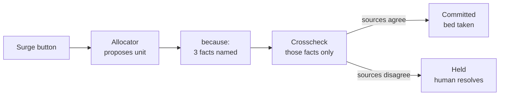

# Concord — Product Requirements

2026-09-18 · HopHacks 2026, Johns Hopkins · team of 2, 36 hours

## What we're building

Concord is a hospital command board that will not move a patient when the records behind that decision disagree with each other.

Two problems combine into one danger. Records from different providers contradict each other, because roughly half of all text in a hospital record is copy-pasted from an earlier note and stale facts look current. And when a hospital is overloaded, nobody has time to check. The result is a bed assignment that was completely logical, made from information that was wrong.

Concord's mechanism: every placement decision must declare which clinical facts it relied on. Only those facts are then checked across all of the patient's source records. If the sources disagree, the placement is held for a human, with both versions and their provenance shown.

**The one sentence that must survive contact with a judge:** we don't flag every contradiction, we flag the ones that are about to change where a patient goes.

## Scope

**In scope**

- 20 synthetic patients, each split into 2 pretend provider sources
- A conflict injector that plants known disagreements and writes a ground-truth answer key
- A greedy allocator that proposes a unit and declares the facts it relied on
- A crosscheck that verifies only those facts and returns conflicts with provenance
- One board screen: capacity bars, patient rows, conflict detail panel
- A surge button that injects 25 patients at once
- A score: precision and recall against the answer key

**Explicitly out of scope**

- Real patient data of any kind
- Ambulance routing, maps, or geography
- Optimization of bed assignment (the allocator is deliberately simple)
- Persistence of any kind between runs
- User accounts, authentication, multi-user

**The safety boundary, which is not negotiable**

Concord never states which value is correct, and never recommends or refuses a placement. It holds for human verification and shows both sources. Held rows say exactly: sources disagree, a human must resolve this.

This is correct on three levels. The software genuinely does not know which record is right. Software that issues a single clinical instruction in a time-critical situation may be treated as a regulated medical device. And a tool that guesses wrong once loses clinician trust permanently.

## Build approach

Build the seam first, not the halves. The seam is a placement declaring what it relied on, and that being checked before the patient moves. It is the entire product and the only part nobody has built before, so it is the part most likely to surprise us.

**Phase 0, hours 0 to 3: the skeleton that lies.** Both people sitting together. Goal: one hardcoded patient goes all the way through and produces an amber held row on a real screen.

Everything is fake except the connections. One patient typed by hand, no Synthea. One conflict typed by hand, no injector. The allocator returns a hardcoded unit and fact list. The check is a string comparison, no AI. The screen shows one row and one detail panel.

At the end of three hours we have a working product that knows one thing. That is worth more than seven finished pieces that have never talked to each other. From here the product is never broken again, and there is always something demoable.

**Then swap one fake piece at a time.** The product works after every swap.

| Order | Swap out | Swap in | Why here |
| --- | --- | --- | --- |
| 1 | hardcoded conflict | injector + answer key | this is the project, do it while fresh |
| 2 | hardcoded patient | Synthea bundles | 20 real-format patients |
| 3 | string comparison | real check with explicit-absence handling | the actual logic |
| 4 | one patient | 25 patients + surge button | now it is a demo |
| 5 | fixed bed counts | capacity that fills up | the board comes alive |
| 6 | no AI | Gemini adjudication | most fragile, so last |
| 7 | nothing | score screen | cheap, and it is the best slide |

Gemini goes in sixth on purpose. The deterministic check already finds real disagreements; the model's job is to filter out same-fact-different-wording and write the reason line. Wire the model in early and every bug becomes "is it my code or the model?"



The `because` list is the seam. It is why the check is fast enough to run during a surge, and why every flag that appears is one a human should care about.

## Tech stack

Small on purpose. Every technology here earns its place in a 36-hour build for two people.

| Layer | Choice | Why this |
| --- | --- | --- |
| Backend | Python 3.11 + FastAPI | One long-lived process holding all state; FastAPI gives typed JSON endpoints with almost no ceremony |
| State | Plain Python objects in memory | The demo is 90 seconds and starts clean every time; persistence buys nothing visible |
| Data | Synthea FHIR R4 sample bundles | Free, pre-built, real format and real medical codes; saying "Synthea, FHIR" signals we know the field |
| AI | Gemini 3.5 Flash-Lite (`gemini-3.5-flash-lite`) | Fast and cheap for two short calls per patient; Gemini is a HopHacks sponsor, so the same code is eligible for a sponsor prize |
| Frontend | React 18 + Vite | Instant hot reload, one page, no framework overhead |
| Transport | HTTP polling, once per second | Visually identical to streaming and roughly a tenth of the work |
| Tests | pytest | ~40 checks in 2 seconds; the safety net that matters at hour 30 |

**Deliberately rejected**

| Rejected | Why not |
| --- | --- |
| SimPy | A list of patients plus a timer produces identical on-screen behavior. SimPy's real-time mode blocks the event loop and fights FastAPI, and external event injection into a running simulation has no first-class support — exactly what the surge button needs |
| Google OR-Tools | A greedy first-free-bed rule is 20 lines. The solver reports infeasibility as a single word with no explanation, which is undebuggable at 3am. And the allocator is deliberately not our contribution |
| Neo4j | Provenance done properly means a node per claim, which triples graph size and makes every query harder. Judges cannot see the store; they can see whether provenance links work. A claims table renders the identical graph picture |
| WebSockets | Next.js route handlers cannot terminate WebSockets and Vercel cannot hold persistent TCP. Discovering that at hour 33 is a classic loss |
| SNOMED CT | The full distribution requires a UMLS license that takes about 5 business days to approve. A curated ~50-code map for our demo patients plus the public RxNav API covers it. RxNorm + LOINC is a complete story |

**Environment flag.** `CONCORD_STUB=1` makes every AI call return deterministic canned output. The demo must run with the wifi off.

## The contract between us

Agree this in hour one, before splitting up. Once it is agreed, neither person can block the other: frontend builds against this shape with fake data, backend makes real data fit this shape, and they meet in the middle.

Skipping this step is the most common way a two-person team loses a night.

**`GET /state`** — polled once per second

```json
{
  "capacity": [{"unit": "ICU", "total": 10, "occupied": 9, "percent": 90}],
  "departments": [{"unit": "ICU", "line": "1 bed left, holding it for critical patients only"}],
  "rows": [{"pid": "P-14", "complaint": "syncope", "severity": 3,
            "state": "held", "unit": null, "proposed_unit": "STEPDOWN",
            "conflict_count": 1}],
  "metrics": {"held": 3, "committed": 18, "waiting": 4}
}
```

**`GET /patient/{pid}`** — on row click

```json
{
  "pid": "P-14",
  "proposed_unit": "STEPDOWN",
  "because": ["anticoagulant", "vitals_stable", "icu_need"],
  "state": "held",
  "conflicts": [{
    "fact": "anticoagulant",
    "reason": "one source records an active anticoagulant, the other explicitly records none",
    "versions": [
      {"source_name": "Hospital B - Cardiology", "recorded_date": "2026-08-28",
       "value": "warfarin 5mg", "status": "active",
       "resource_id": "MedicationStatement/m2"},
      {"source_name": "Local intake", "recorded_date": "2026-09-18",
       "value": "none recorded", "status": "absent",
       "resource_id": "MedicationStatement/m1"}
    ]
  }],
  "notice": "sources disagree; a human must resolve"
}
```

**`POST /surge`** returns `{"decided": 25}`. **`GET /score`** returns `{"planted": 50, "caught": 46, "precision": 0.92, "recall": 0.92}`. **`POST /reset`** returns the board to its starting state.

Fixed vocabulary, so neither person invents a sixth value. Facts: `anticoagulant`, `penicillin_allergy`, `icu_need`, `vitals_stable`, `active_diabetes`. Units: `ER`, `ICU`, `STEPDOWN`, `OR`. States: `waiting`, `committed`, `held`. All dates are ISO strings.

## Backend owner

Owns the Python core: the part that wins. Files are small and single-purpose so that when something breaks at 3am you know which file.

- [ ] **`models.py`** — dataclasses for Claim, SourceRecord, Patient, Plan, Conflict, Verdict, plus the closed FACTS and UNITS tuples. Done when: pytest confirms the fact vocabulary is exactly five entries.
- [ ] **`sources.py`** — read a Synthea bundle, extract claims, split into two pretend sources. Records facts not asserted as explicit absence, never silence. Done when: a real downloaded bundle produces claims with correct provenance.
- [ ] **`injector.py`** — plant value, status, existence and temporal conflicts into the second source only; write the answer key. Done when: planting is deterministic for a given seed, and some patients are left clean so false positives are detectable.
- [ ] **`hospital.py`** — bed counts, occupy, release, snapshot. Done when: occupancy percentage can exceed 100 under surge.
- [ ] **`allocator.py`** — pick a unit by severity, fall back to ER when full, return the `because` list. No AI. Done when: every unit declares at least one fact.
- [ ] **`crosscheck.py`** — deterministic pass finds candidate disagreements, Gemini adjudicates genuine versus wording. Done when: facts outside the `because` list are provably never checked.
- [ ] **`gemini.py`** — prompt in, parsed JSON out, stub fallback on any exception. Done when: it works with the wifi off.
- [ ] **`patient_queue.py`** — the decide loop: propose, verify, then hold or commit. Done when: a held patient takes no bed.
- [ ] **`score.py`** — precision and recall against the answer key. Done when: a false positive provably lowers precision.
- [ ] **`departments.py`** — one plain-English status line per unit.
- [ ] **`main.py`** — the five endpoints from the contract above.

**Order matters.** The injector is third, not last. It is the project, and it is the piece that turns "we built a thing" into "we measured a thing."

**Data setup, do before kickoff.** Download the pre-built 1K sample from synthea.mitre.org/downloads and unzip into `data/synthea/`. Do not run the generator — 1000 patients takes over four hours. Open one bundle and read it by hand; judges will ask to see one.

## Frontend owner

Owns everything visible. Polish is 25% of the score at HopHacks, weighted equally with technical difficulty, so this work is not secondary.

Build against the contract with hardcoded fake JSON from hour 3. Never wait for the backend.

- [ ] **`api.js`** — `fetchState`, `triggerSurge`, `fetchPatient`, `fetchScore`. Done when: a failed fetch does not blank the screen.
- [ ] **Polling loop** — `setInterval` at 1000ms, cleaned up on unmount. Done when: the board updates without a manual refresh.
- [ ] **Capacity bars** — one row per unit, fill width by percent, red past 100%. Done when: ER at 112% renders without breaking layout.
- [ ] **The surge button** — large, red, unmissable. A judge must want to press it. Done when: someone who has never seen the app knows what to click.
- [ ] **Patient rows** — green left border for committed, amber for held, clickable. Done when: held and committed are distinguishable at a glance from two metres away.
- [ ] **Conflict detail panel** — both source versions side by side with source name, date, value, status and resource id. Done when: clicking any held row shows the receipt.
- [ ] **Score display** — caught over planted, shown after a surge.
- [ ] **Dead pixel pass** — remove every control that does nothing. Done when: nothing on screen is unexplained.

**Design notes.** Dark background reads better in a bright conference room and on a projector. Use a monospace face for the record data — it signals clinical precision and makes columns line up. Semantic color only: green means committed, amber means held, red means over capacity. No other accent colors.

**The one screen must show all three zones at once:** capacity at the top, patient rows in the middle, conflict detail at the bottom. A judge should understand the product from the picture alone, before anyone speaks.

## Timeline and checkpoints

| Hours | Work | Who |
| --- | --- | --- |
| 0–1 | Repo, FastAPI up, React page rendering, contract agreed on paper | both, together |
| 1–3 | Phase 0: one hardcoded patient end to end, amber row on screen | both, together |
| 3–9 | Injector + answer key; real check | backend |
| 3–9 | Board layout, capacity bars, row states | frontend |
| 9–15 | Synthea ingestion; 25 patients; surge wired | backend |
| 9–15 | Conflict detail panel with full provenance | frontend |
| 15–18 | Sleep. Both of you | — |
| 18–26 | Gemini adjudication; score endpoint | backend |
| 18–26 | Score display; polish; dead pixel pass | frontend |
| 26–28 | Offline test; fix whatever it breaks | both |
| 28–32 | Rehearse the 90 seconds aloud, ten times; write README | both |
| 32–36 | Devpost submission, then buffer | both |

**Hard gates.** Miss one and cut scope immediately rather than pushing the gate.

- **Hour 3** — one hardcoded patient shows as an amber row on screen
- **Hour 9** — conflicts planted, answer key written, real check finds them
- **Hour 15** — button works, 25 patients, capacity bars live, provenance clickable
- **Hour 18** — sleep, non-negotiable, staggered if you must
- **Hour 28** — wifi off, press the button, it still works
- **Hour 32** — submitted. This is a wall, not a suggestion

**Two habits.** Commit after every swap, not at the end of the night — at hour 30, being able to return to what worked twenty minutes ago is worth more than any feature. And run pytest before every commit; the real danger is not code that fails, it is code that worked three hours ago and quietly stopped while you were looking elsewhere.

**Hackathon rule.** The first commit must be after kickoff. Downloading data and creating accounts beforehand is fine; writing code is not.

## Cut order

Decide this now, while calm, so that at hour 30 nobody argues about it.

1. 20 patients becomes 10
2. Two sources becomes two, but only one planted conflict kind
3. Two Gemini calls becomes one combined call
4. Gemini removed entirely — run `use_llm=False`, ship the deterministic check
5. Department status lines removed
6. The arrival timer removed; the button becomes the only way patients arrive
7. Score screen removed — last, because it is cheap and it is the best slide

Cutting Gemini is survivable and should not feel like failure. The deterministic pass already finds genuine disagreements, the demo looks identical, and the honest line to a judge is: the model adjudicates ambiguous wording, here is the code path, we ran out of time to tune it. Judges respect that more than a broken feature.

**Never cut, under any circumstances:**

- The conflict injector
- The answer key and the score it enables
- Clickable provenance on every conflict

Those three are the project. Everything else is presentation.

## Definition of done

The demo counts as working only when all of these are true.

- [ ] A judge presses the surge button and 25 patients arrive on screen
- [ ] At least one row turns amber and stops, every run
- [ ] Clicking any amber row shows two source records with source name, date, value and status
- [ ] Every conflict traces to a real resource id from a real bundle
- [ ] The score shows caught over planted from the actual answer key, not a hardcoded number
- [ ] Pressing the button twice does not produce an identical scripted result
- [ ] **The whole thing runs with the wifi turned off**
- [ ] Both people can deliver the 90-second script without notes
- [ ] The README states plainly that we injected the conflicts ourselves, and why

The wifi test is the one people skip. Conference networks fail, and they fail at hour 34 in front of a judge. Run `CONCORD_STUB=1`, disable the network, and press the button. If it breaks, that is a hour-28 problem, not a hour-35 problem.

**What we will not claim.** That this works on real patient records. That the hospital is realistic beyond its bed counts matching national averages. That CMS requires anything — the 2026 CMS Interoperability Framework is voluntary, and saying "requires" invites a correction on stage. The citable claim is 45 CFR 170.315(b)(2): certified systems must offer reconciliation of medications, allergies and problems, while nothing requires anything that finds the contradictions.
